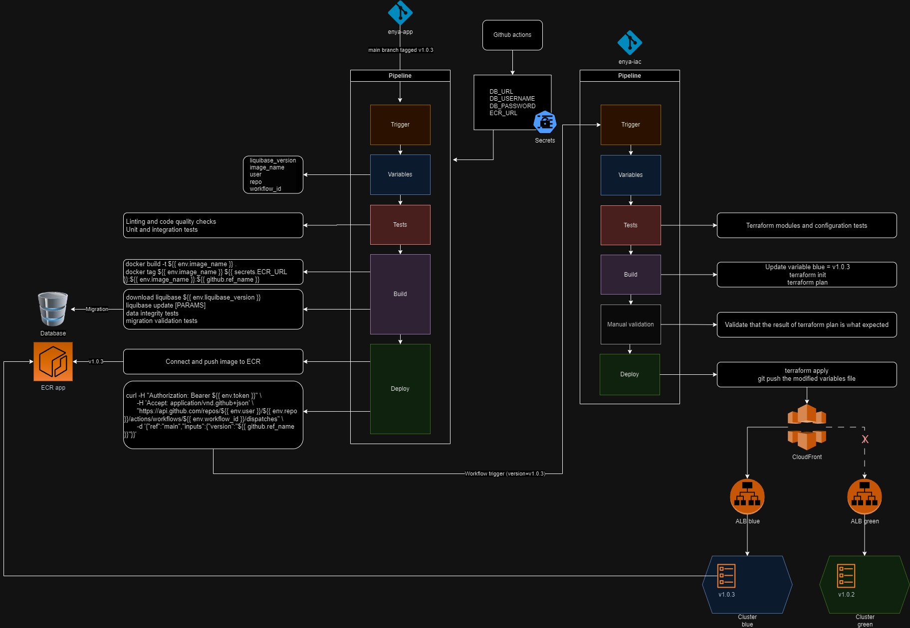

# Documentation
This is a home assessment for a Senior DevOps position at [Enya Labs](https://www.enya.ai/). You can find the assessment description [here](./home-assessment.md).

## Table of Contents
1. [Assumptions](#assumptions)
2. [Architecture diagram](#architecture-diagram)
3. [Branch naming convention](#branch-naming-convention)
4. [Pipeline tooling](#pipeline-tooling)
5. [Pipeline configuration](#pipeline-configuration)
    1. [Permanent branches](#permanent-branches)
    2. [Temporary branches](#temporary-branches)
6. [Containerization](#containerization)
7. [Deployment](#deployment)
8. [Database migration](#database-migration)
    1. [Migration prerequisites](#migration-prerequisites)
    2. [Database migration tool](#database-migration-tool)
    3. [Migration steps](#migration-steps)
9. [How to run the pipeline](#how-to-run-the-pipeline)

## Assumptions
To realize this home assessment, I made these assumptions:
- Use of AWS as Cloud Platform, it's ECS service is the best one for this use case, easier to set up, use and maintain than K8S
- The different AWS accounts are fully configured 
- ALB, ECS cluster, service, task definition, ... are fonctionnal
- The Github Actions runner are implemented into our AWS account and have suffisant access
- 1 repository for application code (`enya-app`) and 1 for IAC code (`enya-iac`)

## Architecture diagram
As mentionned in the [pipeline configuration](#pipeline-configuration) part, it's better to have a workflow file per environment, so in this diagram it shows only the `production` part.

## Branch naming convention
A well-structured branch naming convention is essential for maintaining a development process and effective collaboration within a software development team.

There is 2 type of branches, permanent (never deleted) and temporary (merged into another branch and deleted).

There are many excellent naming conventions regarding git branches, here's my proposition:

### Permanent branches
1. **Development branch**
    - **Branch name:** `develop`
    - **Purpose:** this branch is used for integrating features and bug fixes. It's a staging area before changes are merged into the `main` branch if there isn't `test` and `staging` branches
    - **Deployment:** automatic deployments triggered on every commit to the `develop` branch, after successful tests and code review it will push the docker image into ECR and trigger the `workflow_dispatch` of the `enya-iac` repository to rolling update ECS task in `dev` environment
2. **QA branch (Optional)**
    - **Branch name:** `test`
    - **Purpose:** this branch contains all the code ready to be tested by QA team
    - **Deployment:** same as for `develop` there is an automatic deployment for `qa` environment, so the QA team can test and validate all the features and fixes before going to `staging` or `production`
3. **Staging branch (Optional)**
    - **Branch name:** `staging`
    - **Purpose:** this branch contains all the tested features that can be available for a demo or a proposal
    - **Deployment:** same as for `develop` and `qa` there is an automatic deployment for `staging` environment
4. **Main branch**
    - **Branch name:** `main`
    - **Purpose:** this branch represents the production-ready codebase. It should always reflect the latest stable release
    - **Deployment:** No direct deployments from `main` branch. We need to tag `main` branch like `v.*.*.*` to launch an automatic or manual deployment (depends on company's culture) on the `production` environment

There is some “small” teams that don’t have a `test` and `staging` branches, so their flow is to merge `develop` into `main`, otherwise, the good flow is `develop` → `test` → `staging` → `main`.

### Temporary branches
1. **Feature branches:**
    - **Branch Name:** `feature/<feature-name>`
    - **Purpose:** Feature branches are used for developing new features or enhancements. The branch off from the `develop` branch and are named after the feature they implement
    - **Deployments:** No direct deployments from feature branches. Features are merged into the `develop` branch via pull requests after passing tests and code review
    - **Example**: `feature/create-new-button-component`
2. **Bugfix Branches:**
    - **Branch Name:** `bugfix/<issue-number>`
    - **Purpose:** Bugfix branches address specific issues or bugs in the codebase
    - **Deployments:** Similar to feature branches, there isn’t direct deployment, bugfix branches are merged into the `develop` branch through pull requests after successful testing and review
    - **Example:** `bugfix/issue-123`
3. **Hotfix Branches:**
    - **Branch Name:** `hotfix/<hotfix-name>`
    - **Purpose:** Hotfix branches are created to quickly address critical issues in the production environment.
    - **Deployments:** Hotfixes can be deployed directly to production after thorough testing and approval, bypassing the `main` branch
    - **Example:** `hotfix/zero-day-exploit`
4. **Release Branches:**
    - **Branch Name:** `release/<version-number>`
    - **Purpose:** Release branches prepare the codebase for a new production release.
    - **Deployments:** Deployments triggered from release branches are typically used for staging or pre-production environments to ensure that the upcoming release is stable
    - **Example:** `release/v1.2.3`

## Pipeline tooling
The CI/CD tool depends a lot on which repository hosting platform we are using, if Github, then we will use `Github Actions` or `Travis CI`, for Gitlab it's `Gitlab CI`, Azure DevOps it's `ADO` and so on.

I already used all of them in different projects, they are similar, propose YAML pipelines so we can integrate them directly into the code.

Based on my experience, the price, easy to set up and use, the features and the marketplace, I recommend to use `Github Actions`.

## Pipeline configuration
First of all, we need to put all credentials like database url, login and password, ECR url, ... etc into Github Action Secrets.
Next, create workflow files into the application repository into `.github/workflows` folder.

**It's better to create one workflow file per environment**, because even if it's launched regarding the branches, there will be some `if statements` to handle all the differences between `dev`, `qa`, `staging` and `production` environments, so the code becomes unreadable.

Here is the body of a workflow file for the `enya-app` repository:
- **The trigger part:** showing how the workflow will be triggered
- **The variables part:** defining all the global variables
- **The test part:** running tests early in the workflow provides faster feedback to developers. This helps identify and fix issues sooner, reducing the probability of broken deployments
- **The build part:**
    - building and tagging the docker images
    - adding [database migration steps](#migration-steps) here
- **The deploy part:**
    - connecting and pushing docker images to `AWS ECR`
    - triggering `workflow_dispatch` of `enya-iac` repository

## Containerization
To create a well-structured and secure dockerized application, we need to follow some best practices, **which need to be updated over time**:

- To reduce the image size, have a small, efficient image and improve build performance:
    - Use `alpine` as base image
    - Minimize the number of layers
    - Put only the necessary dependances
    - Remove the unnecessary dependances and files
    - Utilize multi-stage builds
    - Add a `.dockerignore` file to exclude unnecessary files and directories to not copy into the image during the build process
- Every image must be stateless and do only one thing, so the scale and the update is easier and faster
- Separate the application code and the configuration allow to change configurations without modifying the code or the image
- Need to implement health-check within the container so `ECS cluster` can automatically handle failures and restart them
- Use limited CPU and RAM to prevent containers from consuming excessive resources and so impacting the host system
- For the security:
    - Regularly update base images and dependencies to patch security vulnerabilities with tools like `ECR scan`, `Clair`, `Trivy`, … etc
    - Run containers in `rootless` mode whenever it’s possible, this reduce the potential security vulnerabilities
    - Use environment variables or secrets management instead of hardcoding sensitive information directly into `Dockerfile`
    - Limit the number of exposed ports

> If we are using our own Github Action runners, we can create a `cron` to regularly launch `docker system prune` to remove unused images, containers and volumes to free the disk space.

## Deployment
As described in the [pipeline configuration](#pipeline-configuration) part, different branches of the `enya-app` repository will push docker images to `AWS ECR`.

Every time that there is a new image into ECR, it will automatically launch the image scanning and will show all the vulnerabilities (if the severity is `CRITICAL` or `HIGH` we must fix them before using).

Now, that we have the good images into ECR and ECS part is already done (in the assumpions), it will launch a task into `Cluster blue` which will pull the image from ECR (thanks to VPC endpoint) and after some seconds it will be available to use.

Test team can validate that the new version of the application is fully fonctionnal and so we can switch CloudFront's parameter to send all the traffic to `ALB blue` which will send himselves to the new task.

For more details see the [Architecture diagram](#architecture-diagram).

> In development environment we can have a `rolling update` deployment, but in production environment it’s necessary to have a `blue/green` deployment.

> If an update causes issues, it’s easy to rollback with blue/green deployment.

## Database migration
### Migration prerequisites
Before adding a database migration into the pipeline, I suppose that these prerequisites are done:

- There is some schema changes, the migration and rollback scripts are created and putted in the `enya-app` repository’s migration script folder
- Ensure that the schema changes are backward compatible, otherwise, need to create a script to move data from old schema to the new schema
- All the scripts was tested in staging environment and succeded
- Did a backup with Liquibase before launching the pipeline
- Put database connection creds into Github Actions Secrets
- Scheduled a maintenance window (communicated with users) during which the application can be taken offline or switched to a read-only mode to prevent data inconsistency during migration

### Database migration tool
To add a database migration into the pipeline, we will use Liquibase. Liquibase is an open-source database migration tool which offers a number of options, including XML, SQL, YAML and JSON migration scripts, rollbacks, snapshots … etc.

### Migration steps
After that we are done with all prerequisites, here are the steps to integrate the database migration into the pipeline:

- Download Liquibase, setup the required environment variables for the database
- Run Liquibase to apply all the changes specified in the migration script
- Add automated tests to verify data integrity during the migration process
- Add automated tests to validate that the migration is successful
- If there is data migration too, must be added here

> If there is an error during the migration or tests steps, need to check logs and maybe launch the rollback script or restore the database.

## How to run the pipeline
We can run this pipeline manually by choosing the branch or every time that there is a commit on `develop`, `test`, `staging`, `hotfix/<hotfix-name>`, `release/<version-number>` branches or a tag like `v*.*.*` on the `main` branch, this pipeline will be launched automatically and goes through all the steps defined into the [pipeline configuration](#pipeline-configuration).

> I think that it's not a good idea to put a database migration into the same pipeline as the application deployment, because I'm not sure that we have a database migration every time that we want to deploy a new version of the application. Sometime we can have issues because of this. I propose to have a separate workflow file for the database migrations where we can specify the name of the migration script file to execute.
